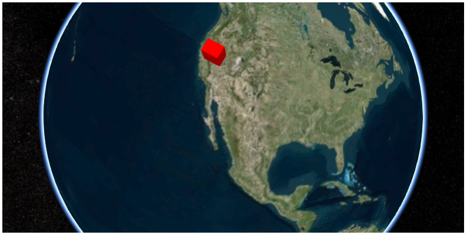

Basics
======

Installation
------------

Use ``pip``

.. code-block:: sh

  pip install cesiumpy

Display Cesium Widget
---------------------

The easiest way to show the ``Cesium`` on your browser is to use ``CesiumWidget`` on
``Jupyter Notebook``.  Because ``CesiumWidget`` has ``_repr_html_`` method to render
``HTML`` on ``Jupyter Notebook``, the ``Cesium`` will be implemented on the output cell.

.. code-block:: python

  >>> import cesiumpy

  >>> v = cesiumpy.CesiumWidget()
  >>> v

If you do not use ``Jupyter Notebook``, you can use ``.to_html`` method to output ``HTML``.
Save the output as a file then open with your web browser.

.. code-block:: python

  >>> v.to_html()
  u'\n<link rel="stylesheet" href="http://cesiumjs.org/Cesium/Build/CesiumUnminified/Widgets/CesiumWidget/CesiumWidget.css" type="text/css">\n

\n'

Add Entities
------------

``Cesium`` allows you to add various entities on the map. To do this, create ``Viewer`` instance and
add preferable entity.

Even though ``Viewer`` also has various type of user control menus, below example disable almost of them because some of them are not displayed on ``Jupyter Notebook`` properly.

.. code-block:: python

  >>> options = dict(animation=True, baseLayerPicker=False, fullscreenButton=False,
  ...                geocoder=False, homeButton=False, infoBox=False, sceneModePicker=True,
  ...                selectionIndicator=False, navigationHelpButton=False,
  ...                timeline=False, navigationInstructionsInitiallyVisible=False)

  >>> v = cesiumpy.Viewer(**options)
  >>> b = cesiumpy.Box(dimensions=(40e4, 30e4, 50e4), material=cesiumpy.color.RED, position=[-120, 40, 0])
  >>> v.entities.add(b)
  >>> v

.. image:: ./_static/viewer01.png

.. code-block:: python

  >>> v = cesiumpy.Viewer(**options)

  >>> box = cesiumpy.Box(position=[-120, 40, 0], dimensions=(40e4, 30e4, 50e4),
  ...                    material=cesiumpy.color.RED)
  >>> v.entities.add(box)

  >>> ellipse = cesiumpy.Ellipse( position=[-110, 40, 0], semiMinorAxis=25e4,
  ...                            semiMajorAxis=40e4, material=cesiumpy.color.BLUE)
  >>> v.entities.add(ellipse)

  >>> cylinder = cesiumpy.Cylinder(position=[-100, 40, 50e4], length=100e4,
  ...                              topRadius=10e4, bottomRadius=10e4,
  ...                              material=cesiumpy.color.AQUA)
  >>> v.entities.add(cylinder)

  >>> polygon = cesiumpy.Polygon(hierarchy=[-90, 40, -95, 40, -95, 45, -90, 40],
  ...                            material=cesiumpy.color.ORANGE)
  >>> v.entities.add(polygon)

  >>> rectangle = cesiumpy.Rectangle(coordinates=(-85, 40, -80, 45),
  ...                                material=cesiumpy.color.GREEN)
  >>> v.entities.add(rectangle)

  >>> ellipsoid = cesiumpy.Ellipsoid(position=(-70, 40, 0), radii=(20e4, 20e4, 30e4),
  ...                                material=cesiumpy.color.GREEN)
  >>> v.entities.add(ellipsoid)

  >>> wall = cesiumpy.Wall(positions=[-60, 40, -65, 40, -65, 45, -60, 45],
  ...                      maximumHeights=[10e4] * 4, minimumHeights=[0] * 4,
  ...                      material=cesiumpy.color.RED)
  >>> v.entities.add(wall)

  >>> corridor = cesiumpy.Corridor(positions=[-120, 30, -90, 35, -60, 30], width=2e5,
  ...                              material=cesiumpy.color.RED)
  >>> v.entities.add(corridor)

  >>> polyline = cesiumpy.Polyline(positions=[-120, 25, -90, 30, -60, 25],
  ...                              width=0.5, material=cesiumpy.color.BLUE)
  >>> v.entities.add(polyline)

  >>> polylinevolume = cesiumpy.PolylineVolume(positions=[-120, 20, -90, 25, -60, 20],
  ...                                          shape=[-5e4, -5e4, 5e4, -5e4, 5e4, 5e4, -5e4, 5e4],
  ...                                          material=cesiumpy.color.GREEN)
  >>> v.entities.add(polylinevolume)
  >>> v

.. image:: ./_static/viewer02.png

Add Providers
-------------

``Cesium`` has 2 types of providers:

* ``ImageryProvider``
* ``TerrainProvider``

ImageryProvider
^^^^^^^^^^^^^^^

.. code-block:: python

  >>> url = 'http://server.arcgisonline.com/ArcGIS/rest/services/World_Street_Map/MapServer'
  >>> imageryProvider = cesiumpy.ArcGisMapServerImageryProvider(url=url)

  >>> v = cesiumpy.Viewer(imageryProvider=imageryProvider, **options)
  >>> v

.. image:: ./_static/imagery01.png

.. code-block:: python

  >>> url = '//cesiumjs.org/tilesets/imagery/blackmarble'
  >>> credit = 'Black Marble imagery courtesy NASA Earth Observatory'
  >>> imageryProvider = cesiumpy.TileMapServiceImageryProvider(url=url, maximumLevel=8, credit=credit)

  >>> v = cesiumpy.Viewer(imageryProvider=imageryProvider, **options)
  >>> v

.. image:: ./_static/imagery02.png

TerrainProvider
^^^^^^^^^^^^^^^

.. code-block:: python

  >>> url = '//assets.agi.com/stk-terrain/world'
  >>> terrainProvider = cesiumpy.CesiumTerrainProvider(url=url)
  >>> v = cesiumpy.Viewer(terrainProvider=terrainProvider, **options)
  >>> v

.. image:: ./_static/terrain01.png

.. code-block:: python

  >>> terrainProvider = cesiumpy.CesiumTerrainProvider(url=url, requestWaterMask=True)
  >>> v = cesiumpy.Viewer(terrainProvider=terrainProvider, **options)
  >>> v

.. image:: ./_static/terrain02.png
