Basics
======

This section describes the basic usage of ``cesiumpy``. ``cesiumpy`` is the lightweight
wrapper for `Cesium.js <http://cesiumjs.org/>`_.

This package offers limited API intended for:

- Interactive data visualization using ``Jupyter Notebook``

This package DOES NOT intended for:

- Website development using whole functionality of `Cesium.js <http://cesiumjs.org/>`_.

Installation
------------

Use ``pip``.

.. code-block:: sh

  pip install cesiumpy

Display Cesium Widget
---------------------

The easiest way to show the `Cesium.js <http://cesiumjs.org/>`_ on your browser is to use ``CesiumWidget`` on ``Jupyter Notebook``.

Because ``CesiumWidget`` has ``_repr_html_`` method to render ``HTML`` on ``Jupyter Notebook``,
placing variable contains ``CesiumWidget`` will output the map implemented on the output cell.

.. code-block:: python

  >>> import cesiumpy

  >>> v = cesiumpy.CesiumWidget()
  >>> v

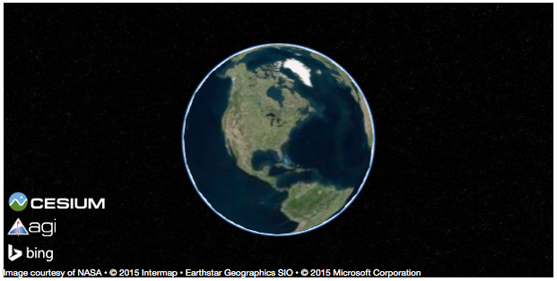

If you do not use ``Jupyter Notebook``, you can use ``.to_html`` method to output rendered ``HTML``.
Save the output as a file then open with your web browser.

.. code-block:: python

  >>> v.to_html()
  u'\n<link rel="stylesheet" href="http://cesiumjs.org/Cesium/Build/CesiumUnminified/Widgets/CesiumWidget/CesiumWidget.css" type="text/css">\n

\n'

Add Entities
------------

`Cesium.js <http://cesiumjs.org/>`_ allows you to add various entities on the map. To do this, create ``Viewer`` instance and add preferable entity.

Even though ``Viewer`` also has various type of user control menus, below example disable almost of them because some of them are not displayed on ``Jupyter Notebook`` properly.

.. code-block:: python

  >>> options = dict(animation=True, baseLayerPicker=False, fullscreenButton=False,
  ...                geocoder=False, homeButton=False, infoBox=False, sceneModePicker=True,
  ...                selectionIndicator=False, navigationHelpButton=False,
  ...                timeline=False, navigationInstructionsInitiallyVisible=False)

  >>> v = cesiumpy.Viewer(**options)
  >>> b = cesiumpy.Box(dimensions=(40e4, 30e4, 50e4), material=cesiumpy.color.RED, position=[-120, 40, 0])
  >>> v.entities.add(b)
  >>> v

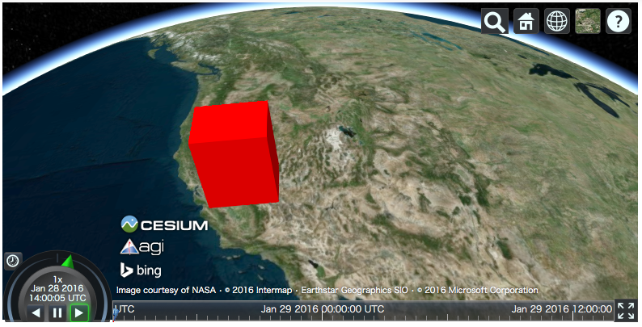

Refer to following document to see the whole list of `Cesium.js <http://cesiumjs.org/>`_ entities:

- http://cesiumjs.org/tutorials/Visualizing-Spatial-Data/

``cesiumpy`` currently supports following entities. Refer to ``cesiumpy`` API document for more details.

- ``Point``
- ``Label``
- ``Box``
- ``Ellipse``
- ``Cylinder``
- ``Polygon``
- ``Rectangle``
- ``Ellipsoid``
- ``Wall``
- ``Corridor``
- ``Polyline``
- ``PolylineVolume``
- ``Billboard``

The below example draws all entities on the map.

.. code-block:: python

  >>> v = cesiumpy.Viewer(**options)

  >>> label = cesiumpy.Label(position=[-90, 50, 0], text='entities')
  >>> v.entities.add(label)

  >>> point = cesiumpy.Point(position=[-120, 40, 0], color=cesiumpy.color.BLUE)
  >>> v.entities.add(point)

  >>> box = cesiumpy.Box(position=[-110, 40, 0], dimensions=(40e4, 30e4, 50e4), material=cesiumpy.color.RED)
  >>> v.entities.add(box)

  >>> ellipse = cesiumpy.Ellipse(position=[-100, 40, 0], semiMinorAxis=25e4,
  ...                            semiMajorAxis=40e4, material=cesiumpy.color.BLUE)
  >>> v.entities.add(ellipse)

  >>> cylinder = cesiumpy.Cylinder(position=[-90, 40, 50e4], length=100e4,
  ...                              topRadius=10e4, bottomRadius=10e4,
  ...                              material=cesiumpy.color.AQUA)
  >>> v.entities.add(cylinder)

  >>> polygon = cesiumpy.Polygon(hierarchy=[-80, 40, -85, 40, -82.5, 45],
  ...                            material=cesiumpy.color.ORANGE)
  >>> v.entities.add(polygon)

  >>> rectangle = cesiumpy.Rectangle(coordinates=(-75, 40, -70, 45),
  ...                                material=cesiumpy.color.GREEN)
  >>> v.entities.add(rectangle)

  >>> ellipsoid = cesiumpy.Ellipsoid(position=(-60, 40, 0), radii=(20e4, 20e4, 30e4),
  ...                                material=cesiumpy.color.GREEN)
  >>> v.entities.add(ellipsoid)

  >>> wall = cesiumpy.Wall(positions=[-50, 35, -55, 35, -55, 40, -50, 40, -50, 35],
  ...                      maximumHeights=10e4, minimumHeights=0,
  ...                      material=cesiumpy.color.RED)
  >>> v.entities.add(wall)

  >>> corridor = cesiumpy.Corridor(positions=[-120, 30, -90, 35, -50, 30], width=2e5,
  ...                              material=cesiumpy.color.RED)
  >>> v.entities.add(corridor)

  >>> polyline = cesiumpy.Polyline(positions=[-120, 25, -90, 30, -50, 25], width=0.5, material=cesiumpy.color.BLUE)
  >>> v.entities.add(polyline)

  >>> polylinevolume = cesiumpy.PolylineVolume(positions=[-120, 20, -90, 25, -50, 20],
  ...                                          shape=[-5e4, -5e4, 5e4, -5e4, 5e4, 5e4, -5e4, 5e4],
  ...                                          material=cesiumpy.color.GREEN)
  >>> v.entities.add(polylinevolume)
  >>> v

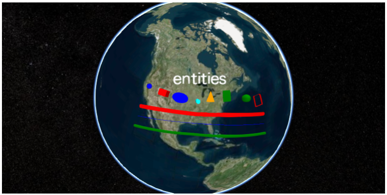

The below example draws various ``Pin`` on the map.

.. code-block:: python

  >>> v = cesiumpy.Viewer(**options)
  >>> pin1 = cesiumpy.Pin()
  >>> bill1 = cesiumpy.Billboard(position=[-120, 40, 0], image=pin1)
  >>> v.entities.add(bill1)

  >>> pin2 = cesiumpy.Pin(cesiumpy.color.RED)
  >>> bill2 = cesiumpy.Billboard(position=[-100, 40, 0], image=pin2)
  >>> v.entities.add(bill2)

  >>> pin3 = cesiumpy.Pin.fromText('!', color=cesiumpy.color.GREEN)
  >>> bill3 = cesiumpy.Billboard(position=[-80, 40, 0], image=pin3)
  >>> v.entities.add(bill3)
  >>> v

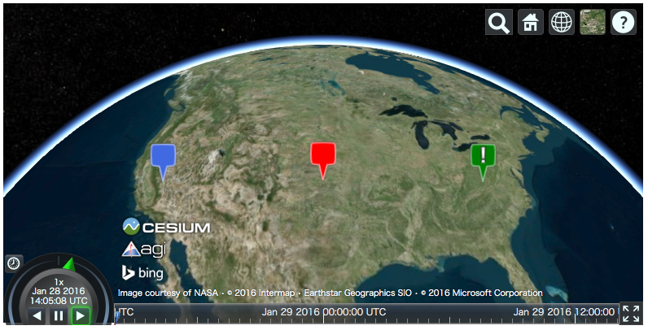

Camera
------

``CesiumWidget`` and ``Viewer`` has a ``camera`` property which allows you to
specify the location to be displayed. You can call ``flyTo`` method to specify
the location passing ``tuple`` or ``list``.

If input length is 3, it will be regarded as the point specified by (``longitude``, ``latitude``, ``height``).

.. code-block:: python

  >>> v = cesiumpy.Viewer(**options)
  >>> v.camera.flyTo((-117.16, 32.71, 15000))
  >>> v

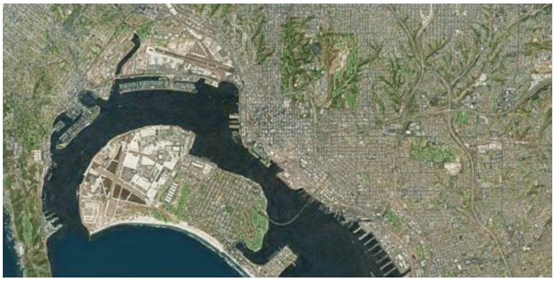

- If input length is 4, it will be regarded as the rectangle specified by (``west``, ``south``, ``east``, ``north``).

.. code-block:: python

  >>> v = cesiumpy.Viewer(**options)
  >>> v.camera.flyTo((135, 30, 145, 45))
  >>> v

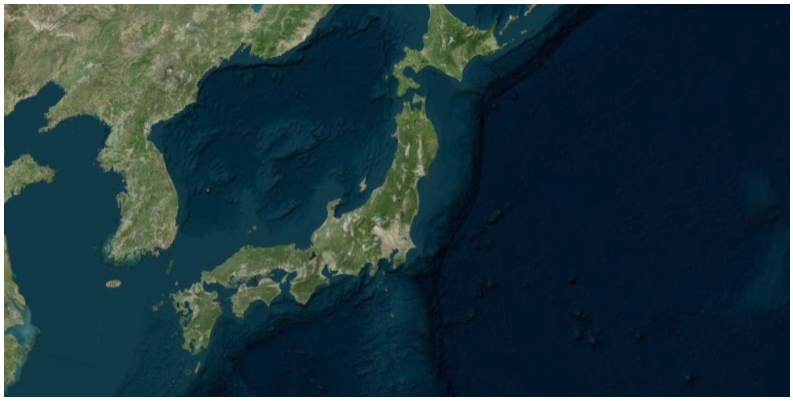

Add Providers
-------------

`Cesium.js <http://cesiumjs.org/>`_ supports some "layers" to cover the map. Objects which provides "layers" are called as "provider". There are 2 types of providers as below:

* ``ImageryProvider``: Provides layers with imagery
* ``TerrainProvider``: Provides layers with terrain and water effects

ImageryProvider
^^^^^^^^^^^^^^^

Refer to following document for the general explanation of ``ImageryProvider``:

- http://cesiumjs.org/tutorials/Imagery-Layers-Tutorial/

The below example outputs the map covered by the image provided by the ArcGIS MapServer,
as the same as the above tutorial.

.. code-block:: python

  >>> url = 'http://server.arcgisonline.com/ArcGIS/rest/services/World_Street_Map/MapServer'
  >>> imageryProvider = cesiumpy.ArcGisMapServerImageryProvider(url=url)

  >>> v = cesiumpy.Viewer(imageryProvider=imageryProvider, **options)
  >>> v

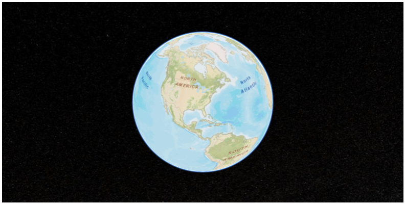

Also you can use other providers.

.. code-block:: python

  >>> url = '//cesiumjs.org/tilesets/imagery/blackmarble'
  >>> credit = 'Black Marble imagery courtesy NASA Earth Observatory'
  >>> imageryProvider = cesiumpy.TileMapServiceImageryProvider(url=url, maximumLevel=8, credit=credit)

  >>> v = cesiumpy.Viewer(imageryProvider=imageryProvider, **options)
  >>> v

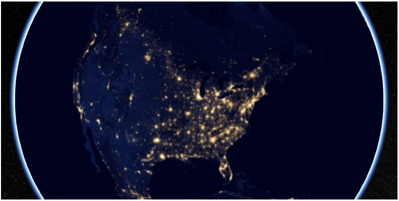

TerrainProvider
^^^^^^^^^^^^^^^

Refer to following document for the general explanation of ``TerrainProvider``:

- http://cesiumjs.org/tutorials/Terrain-Tutorial/

The below example outputs the map covered by the terrain provided by the Cesium Terrain Server,
as the same as the above tutorial.

.. code-block:: python

  >>> url = '//assets.agi.com/stk-terrain/world'
  >>> terrainProvider = cesiumpy.CesiumTerrainProvider(url=url)
  >>> v = cesiumpy.Viewer(terrainProvider=terrainProvider, **options)
  >>> v

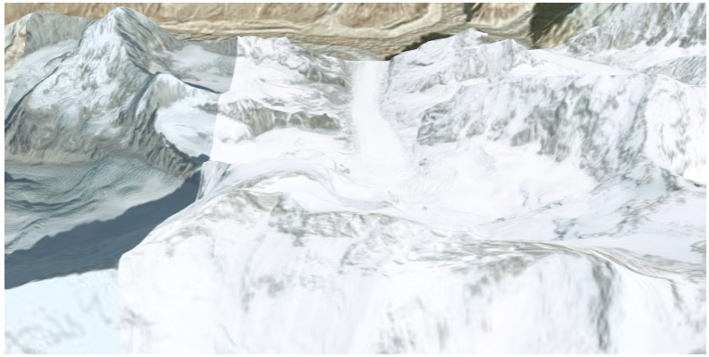

Passing ``requestWaterMask=True`` enables water effects.

.. code-block:: python

  >>> terrainProvider = cesiumpy.CesiumTerrainProvider(url=url, requestWaterMask=True)
  >>> v = cesiumpy.Viewer(terrainProvider=terrainProvider, **options)
  >>> v

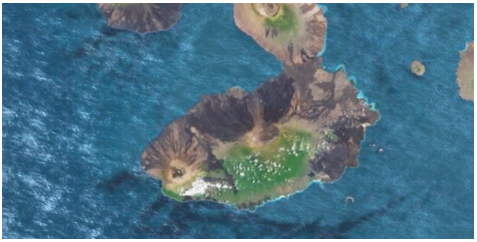

Add Data Sources
----------------

`Cesium.js <http://cesiumjs.org/>`_ has a ``DataSource`` function which
can draw external data as entities.

``cesiumpy`` currently supports following ``DataSource``.

- ``GeoJsonDataSource``

Assuming we hanve following ``.geojson`` file named "example.geojson".

::

  {
      "type": "Point",
      "coordinates": [-118.27, 34.05 ]
  }

You can create ``GeoJsonDataSource`` instannce then add to ``Viewer.DataSources``.
``markerSymbol`` option specifies the symbol displayed on the marker.

.. code-block:: python

  >>> ds = cesiumpy.GeoJsonDataSource('./example.geojson', markerSymbol='!')
  >>> v = cesiumpy.Viewer(**options)
  >>> v.dataSources.add(ds)
  >>> v

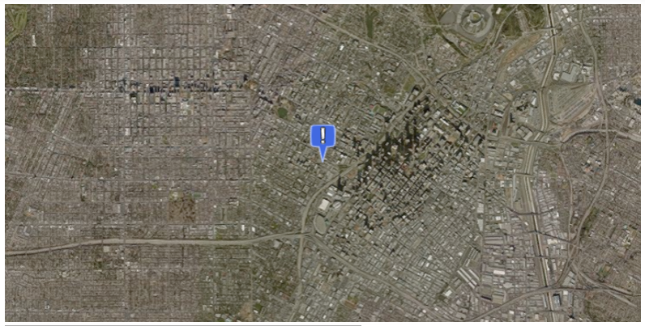

Geocoding
---------

`Cesium.js <http://cesiumjs.org/>`_ handles coordinates using numerics.

For convenience, ``cesiumpy`` automatically converts ``str`` input to coordinates
via geocoding. The geocoding function is internally provided by ``geopy``'s ``Nominatim`` geocoder.

You can use ``str`` specifying location where you can use coordinates as below.

.. code-block:: python

  >>> viewer = cesiumpy.Viewer(**options)
  >>> cyl = cesiumpy.Cylinder(position='Los Angeles', length=30000, topRadius=10000,
  ...                         bottomRadius=10000, material='AQUA')
  >>> v.entities.add(cyl)
  >>> v.camera.flyTo('Los Angeles')
  >>> v

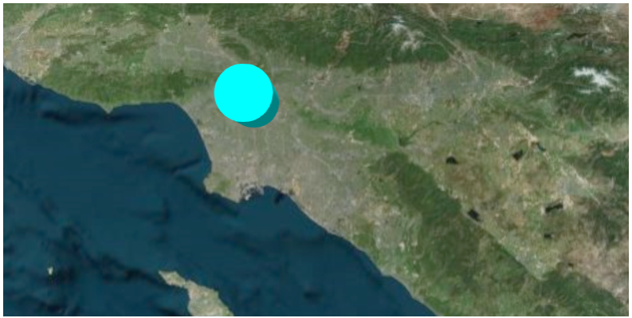