.. _entities.list:

Entities
========

This section describes the basic usage of ``cesiumpy``. ``cesiumpy`` is the lightweight
wrapper for `Cesium.js <http://cesiumjs.org/>`_.

Cartesian
---------

`Cesium.js <http://cesiumjs.org/>`_ handles coordinates using ``Cartesian`` class. ``Cartesian`` may represent following 2 types of coordinates

- Pair of numerics, like ``x``, ``y``, ``z``
- Geolocation (degrees), like ``longitude``, ``latitude``, ``height``

.. code-block:: python

  >>> import cesiumpy

  >>> cesiumpy.Cartesian2(10, 20)
  Cartesian2(10, 20)

  >>> cesiumpy.Cartesian3(10, 20, 30)
  Cartesian3(10, 20, 30)

  >>> cesiumpy.Cartesian3.fromDegrees(-110, 40, 0)
  Cartesian3.fromDegrees(-110, 40, 0)

Basically you don't have to use the ``Cartesian`` classes because ``cesiumpy`` automatically converts python's ``list`` and ``tuple`` to ``Cartesian`` based on it's dimension.

Point
-----

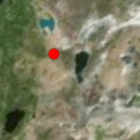

You can create the ``Point`` entity as below. ``position`` keyword can accepts 3 elements of ``list`` or ``tuple`` consists from longitude, latitude and height. ``position`` will be converted to ``Cartesian3`` automatically.

You can specify the color and size of the point via ``color`` and ``pixelSize`` keywords. Refer to the following document to see the details of each options.

- https://cesiumjs.org/Cesium/Build/Documentation/PointGraphics.html

.. code-block:: python

  >>> p = cesiumpy.Point(position=[-110, 40, 0])
  >>> p
  Point(-110, 40, 0)

  >>> p.script
  u'{position : Cesium.Cartesian3.fromDegrees(-110, 40, 0), point : {color : Cesium.Color.WHITE, pixelSize : 10}}'

  >>> p = cesiumpy.Point(position=[-110, 40, 0], color=cesiumpy.color.BLUE, pixelSize=20)
  >>> p
  Point(-110, 40, 0)

  >>> p.script
  u'{position : Cesium.Cartesian3.fromDegrees(-110, 40, 0), point : {color : Cesium.Color.BLUE, pixelSize : 20}}'

The color constants are defined in ``cesiumpy.color``, also you can specify it by name (``str``).

.. code-block:: python

  >>> p = cesiumpy.Point(position=[-110, 40, 0], color=cesiumpy.color.RED)
  >>> p.script
  u'{position : Cesium.Cartesian3.fromDegrees(-110, 40, 0), point : {color : Cesium.Color.RED, pixelSize : 10}}'

  >>> p = cesiumpy.Point(position=[-110, 40, 0], color='blue')
  >>> p.script
  u'{position : Cesium.Cartesian3.fromDegrees(-110, 40, 0), point : {color : Cesium.Color.BLUE, pixelSize : 10}}'

Label
-----

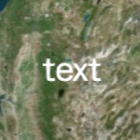

``Label`` represents text displayed on the map. Refer to the following document to see the details of each options.

- https://cesiumjs.org/Cesium/Build/Documentation/LabelGraphics.html

.. code-block:: python

  >>> l = cesiumpy.Label(position=[-110, 40, 0], text='xxx')
  >>> l
  Label(-110, 40, 0)

  >>> l.script
  u'{position : Cesium.Cartesian3.fromDegrees(-110, 40, 0), label : {text : "xxx"}}'

  >>> l = cesiumpy.Label(position=[-110, 40, 0], text='xxx', fillColor='red')
  >>> l.script
  u'{position : Cesium.Cartesian3.fromDegrees(-110, 40, 0), label : {text : "xxx", fillColor : Cesium.Color.RED}}'

Box
---

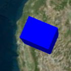

You can create the ``Box`` entity specifying its ``position`` and ``dimensions`` (size of each dimensions). Refer to the following document to see the details of each options.

- https://cesiumjs.org/Cesium/Build/Documentation/BoxGraphics.html

.. code-block:: python

  >>> b = cesiumpy.Box(position=[-110, 40, 0], dimensions=(40e4, 30e4, 50e4))
  >>> b
  Box(-110, 40, 0)

  >>> b.script
  u'{position : Cesium.Cartesian3.fromDegrees(-110, 40, 0), box : {dimensions : new Cesium.Cartesian3(400000.0, 300000.0, 500000.0)}}'

  >>> b = cesiumpy.Box(position=[-110, 40, 0], dimensions=(10, 20, 30), material='blue')
  >>> b.script
  u'{position : Cesium.Cartesian3.fromDegrees(-110, 40, 0), box : {dimensions : new Cesium.Cartesian3(10, 20, 30), material : Cesium.Color.BLUE}}'

Ellipse
-------

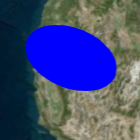

Ellipse can be created by specifying its ``position``, ``semiMinorAxis`` and ``semiMajorAxis``. Refer to the following document to see the details of each options.

- https://cesiumjs.org/Cesium/Build/Documentation/EllipseGraphics.html

.. code-block:: python

  >>> e = cesiumpy.Ellipse(position=[-110, 40, 0], semiMinorAxis=25e4,
  ...                      semiMajorAxis=40e4)
  >>> e
  Ellipse(-110, 40, 0)

  >>> e.script
  u'{position : Cesium.Cartesian3.fromDegrees(-110, 40, 0), ellipse : {semiMinorAxis : 250000.0, semiMajorAxis : 400000.0}}'

  >>> e = cesiumpy.Ellipse(position=[-110, 40, 0], semiMinorAxis=100,
  ...                      semiMajorAxis=200, material='green')
  >>> e.script
  u'{position : Cesium.Cartesian3.fromDegrees(-110, 40, 0), ellipse : {semiMinorAxis : 100, semiMajorAxis : 200, material : Cesium.Color.GREEN}}'

Cylinder
--------

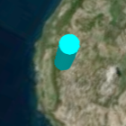

``Cylinder`` can be created by its ``position`` and ``length``. Note that its ``position`` must be specified with the center of the ``Cylinder``. If you want to put the cylinder on the ground, ``height`` should be 100 if cylinder's ``length`` is 200. Refer to the following document to see the details of each options.

- https://cesiumjs.org/Cesium/Build/Documentation/CylinderGraphics.html

.. code-block:: python

  >>> c = cesiumpy.Cylinder(position=[-110, 40, 100], length=200,
  ...                       topRadius=100, bottomRadius=100)
  >>> c
  Cylinder(-110, 40, 100)

  >>> c.script
  u'{position : Cesium.Cartesian3.fromDegrees(-110, 40, 100), cylinder : {length : 200, topRadius : 100, bottomRadius : 100}}'

  >>> c = cesiumpy.Cylinder(position=[-110, 40, 250], length=500,
  ...                       topRadius=100, bottomRadius=100,
  ...                       material=cesiumpy.color.ORANGE)
  >>> c.script
  u'{position : Cesium.Cartesian3.fromDegrees(-110, 40, 250), cylinder : {length : 500, topRadius : 100, bottomRadius : 100, material : Cesium.Color.ORANGE}}'

Polygon
-------

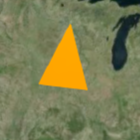

``Polygon`` can be created by ``positions`` kw which specifies ``list`` of positions (``longitude``, ``latitude`` ...). The last position will be automatically connected to the first position.  Refer to the following document to see the details of each options.

- https://cesiumjs.org/Cesium/Build/Documentation/PolygonGraphics.html

.. code-block:: python

  >>> p = cesiumpy.Polygon(hierarchy=[-90, 40, -95, 40, -95, 45, -90, 40])
  >>> p
  Polygon([-90, 40, -95, 40, -95, 45, -90, 40])

  >>> p.script
  u'{polygon : {hierarchy : Cesium.Cartesian3.fromDegreesArray([-90, 40, -95, 40, -95, 45, -90, 40])}}'

Rectangle
---------

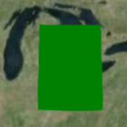

Rectangle can be created 4 elements of ``list`` or ``tuple``, which represents south west longitude, south latitude, east longitude and north latitude. Refer to the following document to see the details of each options.

- https://cesiumjs.org/Cesium/Build/Documentation/RectangleGraphics.html

.. code-block:: python

  >>> r = cesiumpy.Rectangle(coordinates=(-85, 40, -80, 45))
  >>> r
  Rectangle(west=-85, south=40, east=-80, north=45)

  >>> r.script
  u'{rectangle : {coordinates : Cesium.Rectangle.fromDegrees(-85, 40, -80, 45)}}'

Ellipsoid
---------

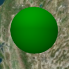

Refer to the following document to see the details of each options.

- https://cesiumjs.org/Cesium/Build/Documentation/EllipsoidGraphics.html

.. code-block:: python

  >>> e = cesiumpy.Ellipsoid(position=(-70, 40, 0), radii=(20e4, 20e4, 30e4))
  >>> e
  Ellipsoid(-70, 40, 0)

  >>> e.script
  u'{position : Cesium.Cartesian3.fromDegrees(-70, 40, 0), ellipsoid : {radii : new Cesium.Cartesian3(200000.0, 200000.0, 300000.0)}}'

Wall
----

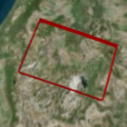

Refer to the following document to see the details of each options.

- https://cesiumjs.org/Cesium/Build/Documentation/WallGraphics.html

.. code-block:: python

  >>> w = cesiumpy.Wall(positions=[-60, 40, -65, 40, -65, 45, -60, 45],
  ...                   maximumHeights=10e4, minimumHeights=0)
  >>> w
  Wall([-60, 40, -65, 40, -65, 45, -60, 45])

  >>> w.script
  u'{wall : {positions : Cesium.Cartesian3.fromDegreesArray([-60, 40, -65, 40, -65, 45, -60, 45]), maximumHeights : [100000.0, 100000.0, 100000.0, 100000.0], minimumHeights : [0, 0, 0, 0]}}'

Corridor
--------

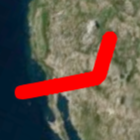

Refer to the following document to see the details of each options.

- https://cesiumjs.org/Cesium/Build/Documentation/CorridorGraphics.html

.. code-block:: python

  >>> c = cesiumpy.Corridor(positions=[-120, 30, -90, 35, -60, 30], width=2e5)
  >>> c
  Corridor([-120, 30, -90, 35, -60, 30])

  >>> c.script
  u'{corridor : {positions : Cesium.Cartesian3.fromDegreesArray([-120, 30, -90, 35, -60, 30]), width : 200000.0}}'

Polyline
--------

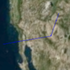

Refer to the following document to see the details of each options.

- https://cesiumjs.org/Cesium/Build/Documentation/PolylineGraphics.html

.. code-block:: python

  p = cesiumpy.Polyline(positions=[-120, 25, -90, 30, -60, 25], width=0.5)
  >>> p
  Polyline([-120, 25, -90, 30, -60, 25])

  >>> p.script
  u'{polyline : {positions : Cesium.Cartesian3.fromDegreesArray([-120, 25, -90, 30, -60, 25]), width : 0.5}}'

PolylineVolume
--------------

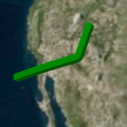

Refer to the following document to see the details of each options.

- https://cesiumjs.org/Cesium/Build/Documentation/PolylineVolumeGraphics.html

.. code-block:: python

  >>> p = cesiumpy.PolylineVolume(positions=[-120, 20, -90, 25, -60, 20],
  ...                             shape=[-5e4, -5e4, 5e4, -5e4, 5e4, 5e4, -5e4, 5e4])
  >>> p
  PolylineVolume([-120, 20, -90, 25, -60, 20])

  >>> p.script
  u'{polylineVolume : {positions : Cesium.Cartesian3.fromDegreesArray([-120, 20, -90, 25, -60, 20]), shape : [new Cesium.Cartesian2(-50000.0, -50000.0), new Cesium.Cartesian2(50000.0, -50000.0), new Cesium.Cartesian2(50000.0, 50000.0), new Cesium.Cartesian2(-50000.0, 50000.0)]}}'

Billboard
---------

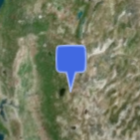

``Billboard`` can dispaly a image on the map. Currently it supports to draw pins. You can pass ``Pin`` instance to the ``Billboard`` via ``image`` keyword.Refer to the following document to see the details of each options.

- https://cesiumjs.org/Cesium/Build/Documentation/BillboardGraphics.html

.. code-block:: python

  >>> p = cesiumpy.Pin()
  >>> b = cesiumpy.Billboard(position=(-110, 40, 0), image=p)
  >>> b
  Billboard(-110, 40, 0)

  >>> b.script
  u'{position : Cesium.Cartesian3.fromDegrees(-110, 40, 0), billboard : {image : new Cesium.PinBuilder().fromColor(Cesium.Color.ROYALBLUE, 48)}}'

You can change how ``Pin`` looks as below. Also, ``Pin`` can have label text to be displayed.

.. code-block:: python

  >>> v = cesiumpy.Viewer(**options)
  >>> pin1 = cesiumpy.Pin()
  >>> bill1 = cesiumpy.Billboard(position=[-120, 40, 0], image=pin1)
  >>> v.entities.add(bill1)

  >>> pin2 = cesiumpy.Pin(cesiumpy.color.RED)
  >>> bill2 = cesiumpy.Billboard(position=[-100, 40, 0], image=pin2)
  >>> v.entities.add(bill2)

  >>> pin3 = cesiumpy.Pin.fromText('!', color=cesiumpy.color.GREEN)
  >>> bill3 = cesiumpy.Billboard(position=[-80, 40, 0], image=pin3)
  >>> v.entities.add(bill3)
  >>> v

.. image:: ./_static/viewer03.png

Material
--------

You can use image file path via ``material`` keyword. The entity will be filled with the
specified image.

.. code-block:: python

  v = cesiumpy.Viewer()
  e = cesiumpy.Ellipse(position=(-120.0, 40.0, 0), semiMinorAxis=40e4,
                       semiMajorAxis=40e4, material='data/cesium_logo.png')
  v.entities.add(e)
  v

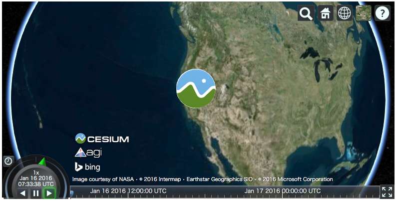
