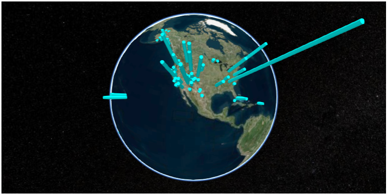

Examples
========

Use with pandas
---------------

.. code-block:: python

  >>> import pandas as pd
  >>> url = "https://en.wikipedia.org/wiki/List_of_national_parks_of_the_United_States"
  >>> df = pd.read_html(url, header=0)[0]

  >>> locations = df['Location'].str.extract(u'(\D+) (\d+°\d+′[NS]) (\d+°\d+′[WE]).*')
  >>> locations.columns = ['State', 'lat', 'lon']
  >>> locations['lat'] = locations['lat'].str.replace(u'°', '.')
  >>> locations['lon'] = locations['lon'].str.replace(u'°', '.')
  >>> locations.loc[locations['lat'].str.endswith('S'), 'lat'] = '-' + locations['lat']
  >>> locations.loc[locations['lon'].str.endswith('W'), 'lon'] = '-' + locations['lon']

  >>> locations['lat'] = locations['lat'].str.slice_replace(start=-2)
  >>> locations['lon'] = locations['lon'].str.slice_replace(start=-2)
  >>> locations[['lat', 'lon']] = locations[['lat', 'lon']].astype(float)

  >>> locations.head()
              State    lat     lon
  0           Maine  44.21  -68.13
  1  American Samoa -14.15 -170.41
  2            Utah  38.41 -109.34
  3    South Dakota  43.45 -102.30
  4           Texas  29.15 -103.15

  >>> df = pd.concat([df, locations], axis=1)

  >>> import cesiumpy

  >>> options = dict(animation=True, baseLayerPicker=False, fullscreenButton=False,
  ...                geocoder=False, homeButton=False, infoBox=False, sceneModePicker=True,
  ...                selectionIndicator=False, navigationHelpButton=False,
  ...                timeline=False, navigationInstructionsInitiallyVisible=False)

  >>> v = cesiumpy.Viewer(**options)

  >>> for i, row in df.iterrows():
  ...     l = row['Recreation Visitors (2014)[5]']
  ...     cyl = cesiumpy.Cylinder(position=[row['lon'], row['lat'], l / 2.], length=l,
  ...                             topRadius=10e4, bottomRadius=10e4, material='aqua', alpha=0.5)
  ...     v.entities.add(cyl)

  >>> v

Use with shapely / geopandas
----------------------------

.. code-block:: python

  >>> import geopandas as gpd

  >>> df = gpd.read_file('ca.json')
  >>> df.head()
    fips                                           geometry      id        name
  0   06  POLYGON ((-123.233256 42.006186, -122.378853 4...  USA-CA  California

  >>> g = df.loc[0, "geometry"]
  >>> type(g)
  shapely.geometry.polygon.Polygon

  >>> import cesiumpy

  >>> options = dict(animation=True, baseLayerPicker=False, fullscreenButton=False,
  ...                geocoder=False, homeButton=False, infoBox=False, sceneModePicker=True,
  ...                selectionIndicator=False, navigationHelpButton=False,
  ...                timeline=False, navigationInstructionsInitiallyVisible=False)

  >>> v = cesiumpy.Viewer(**options)
  >>> v.entities.add(cesiumpy.Wall(positions=g,
  ...                              maximumHeights=10e5, minimumHeights=0,
  ...                              material=cesiumpy.color.RED))
  >>> v

.. image:: ./_static/geopandas01.png