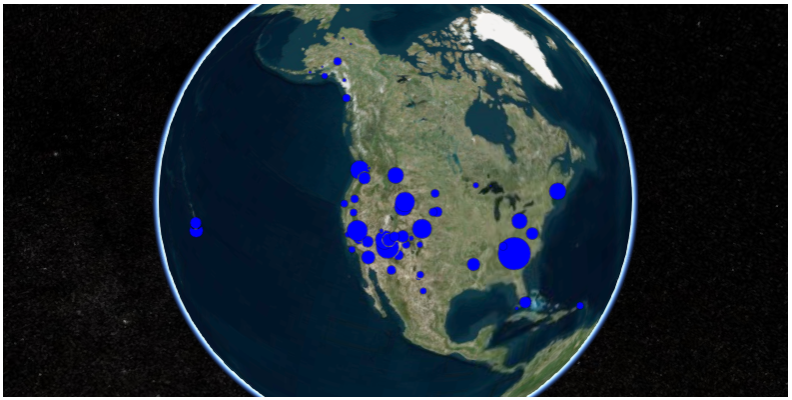
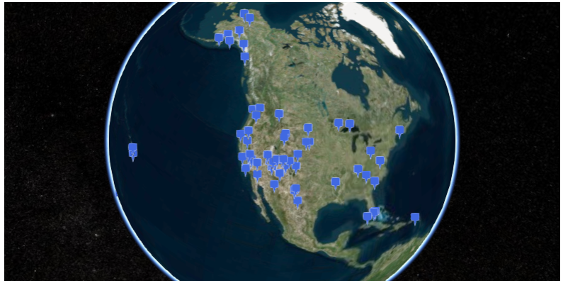
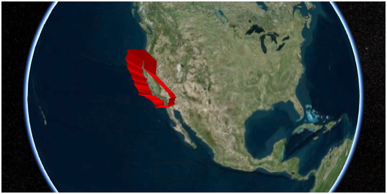
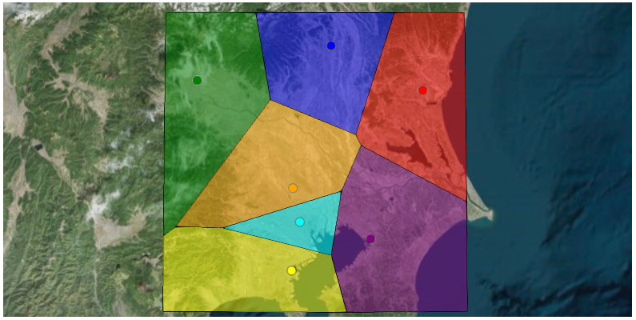
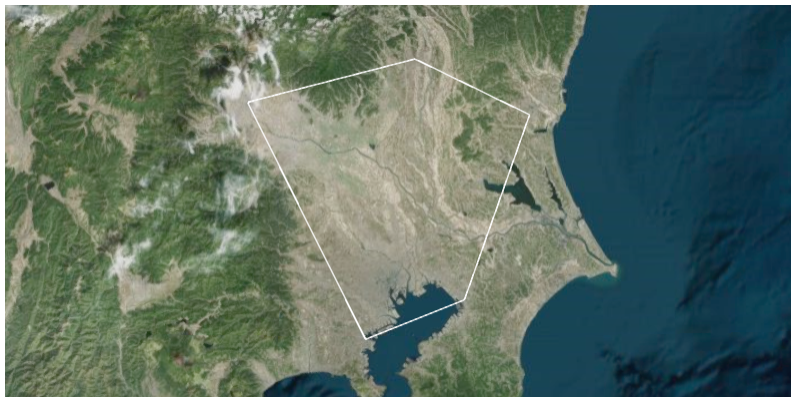

Examples
========

This section lists some examples using ``cesiumpy`` and other packages. You
can find ``Jupyter Notebook`` of these exampless under ``GitHub`` repository
(maps are not rendered on ``GitHub``. Download an run them on local).

- https://github.com/sinhrks/cesiumpy/tree/master/examples

Use with pandas
---------------

Following example shows retrieving "US National Parks" data from Wikipedia,
then plot number of visitors on the map.

First, load data from Wikipedia using ``pd.read_html`` functionality. The data
contains latitude and longitude as text, thus some preprocessing is required.

.. code-block:: python

  >>> import pandas as pd
  >>> url = "https://en.wikipedia.org/wiki/List_of_national_parks_of_the_United_States"
  >>> df = pd.read_html(url, header=0)[0]

  >>> locations = df['Location'].str.extract(u'(\D+) (\d+°\d+′[NS]) (\d+°\d+′[WE]).*')
  >>> locations.columns = ['State', 'lat', 'lon']
  >>> locations['lat'] = locations['lat'].str.replace(u'°', '.')
  >>> locations['lon'] = locations['lon'].str.replace(u'°', '.')
  >>> locations.loc[locations['lat'].str.endswith('S'), 'lat'] = '-' + locations['lat']
  >>> locations.loc[locations['lon'].str.endswith('W'), 'lon'] = '-' + locations['lon']

  >>> locations['lat'] = locations['lat'].str.slice_replace(start=-2)
  >>> locations['lon'] = locations['lon'].str.slice_replace(start=-2)
  >>> locations[['lat', 'lon']] = locations[['lat', 'lon']].astype(float)

  >>> locations.head()
              State    lat     lon
  0           Maine  44.21  -68.13
  1  American Samoa -14.15 -170.41
  2            Utah  38.41 -109.34
  3    South Dakota  43.45 -102.30
  4           Texas  29.15 -103.15

  >>> df = pd.concat([df, locations], axis=1)

Once prepared the data, iterate over rows and plot its values. The below script adds
``cesiumpy.Cylinder`` which height is corresponding to the number of visitors.

.. code-block:: python

  >>> import cesiumpy

  >>> options = dict(animation=True, baseLayerPicker=False, fullscreenButton=False,
  ...                geocoder=False, homeButton=False, infoBox=False, sceneModePicker=True,
  ...                selectionIndicator=False, navigationHelpButton=False,
  ...                timeline=False, navigationInstructionsInitiallyVisible=False)

  >>> v = cesiumpy.Viewer(**options)

  >>> for i, row in df.iterrows():
  ...     l = row['Recreation Visitors (2014)[5]']
  ...     cyl = cesiumpy.Cylinder(position=[row['lon'], row['lat'], l / 2.], length=l,
  ...                             topRadius=10e4, bottomRadius=10e4, material='aqua', alpha=0.5)
  ...     v.entities.add(cyl)

  >>> v

.. image:: ./_static/example_pandas01.png

If you want bubble chart like output, use ``Point`` entities.

.. code-block:: python

  >>> v = cesiumpy.Viewer(**options)
  >>> for i, row in df.iterrows():
  ...     l = row['Recreation Visitors (2014)[5]']
  ...      p= cesiumpy.Point(position=[row['lon'], row['lat'], 0],
  ...                        pixelSize=np.sqrt(l / 10000), color='blue')
  >>> v.entities.add(p)
  >>> v

Using ``Billboard`` with ``Pin`` points the locations of National Parks.

.. code-block:: python

  >>> v = cesiumpy.Viewer(**options)
  >>> pin = cesiumpy.Pin()
  >>> for i, row in df.iterrows():
  ...     b = cesiumpy.Billboard(position=[row['lon'], row['lat'], 0], image = pin, scale=0.4)
  >>> v.entities.add(b)
  >>> v

Use with shapely / geopandas
----------------------------

Following example shows how to handle ``geojson`` files using ``shapely``, ``geopandas`` and ``cesiumpy``.

First, read ``geojson`` file of US, California using ``geopandas`` function.
The content will be ``shapely`` instance.

.. code-block:: python

  >>> import geopandas as gpd

  >>> df = gpd.read_file('ca.json')
  >>> df.head()
    fips                                           geometry      id        name
  0   06  POLYGON ((-123.233256 42.006186, -122.378853 4...  USA-CA  California

  >>> g = df.loc[0, "geometry"]
  >>> type(g)
  shapely.geometry.polygon.Polygon

We can use this ``shapely`` instance to specify the shape of ``cesiumpy`` instances.
The below script adds ``cesiumpy.Wall`` which has the shape of California.

.. code-block:: python

  >>> import cesiumpy

  >>> options = dict(animation=True, baseLayerPicker=False, fullscreenButton=False,
  ...                geocoder=False, homeButton=False, infoBox=False, sceneModePicker=True,
  ...                selectionIndicator=False, navigationHelpButton=False,
  ...                timeline=False, navigationInstructionsInitiallyVisible=False)

  >>> v = cesiumpy.Viewer(**options)
  >>> v.entities.add(cesiumpy.Wall(positions=g,
  ...                              maximumHeights=10e5, minimumHeights=0,
  ...                              material=cesiumpy.color.RED))
  >>> v

Use with scipy
--------------

``cesiumpy`` has ``spatial`` submodule which offers functionality like ``scipy.spatial``. These function
requires ``scipy`` and ``shapely`` installed.

Following example shows Voronoi diagram using ``cesiumpy``. First, prepare a list contains the geolocations of Japanese Prefectual goverments.

.. code-block:: python

  >>> import cesiumpy

  >>> options = dict(animation=True, baseLayerPicker=False, fullscreenButton=False,
  ...                geocoder=False, homeButton=False, infoBox=False, sceneModePicker=True,
  ...                selectionIndicator=False, navigationHelpButton=False,
  ...                timeline=False, navigationInstructionsInitiallyVisible=False)

  >>> points = [[140.446793, 36.341813],
  ...           [139.883565, 36.565725],
  ...           [139.060156, 36.391208],
  ...           [139.648933, 35.857428],
  ...           [140.123308, 35.605058],
  ...           [139.691704, 35.689521],
  ...           [139.642514, 35.447753]]

Then, you can create ``cesiumpy.spatial.Voronoi`` instance passing ``points``. Using ``get_polygons`` method returns the ``list`` of ``cesiumpy.Polygon`` instances. Each ``Polygon`` represents the region corresponding to the point.

.. code-block:: python

  >>> vor = cesiumpy.spatial.Voronoi(points)
  >>> polygons = vor.get_polygons()
  >>> polygons[0]
  Polygon([140.70970652380953, 35.78698294268851, 140.06610971077615, 36.06956523268194, 140.03367654609778, 36.1229878712242, 140.27531919409412, 36.730815523809525, 140.70970652380953, 36.730815523809525, 140.70970652380953, 35.78698294268851])

  >>> v = cesiumpy.Viewer(**options)
  >>> colors = [cesiumpy.color.RED, cesiumpy.color.BLUE, cesiumpy.color.GREEN,
  ...           cesiumpy.color.ORANGE, cesiumpy.color.PURPLE, cesiumpy.color.AQUA,
  ...           cesiumpy.color.YELLOW]

  >>> for p, pol, c in zip(points, polygons, colors):
  ...     b = cesiumpy.Point(position=(p[0], p[1], 0), color=c)
  ...     v.entities.add(b)
  ...     pol.material = c.set_alpha(0.5)
  ...     pol.outline = True
  ...     v.entities.add(pol)
  >>> v.camera.flyTo((139.8, 36, 3e5))
  >>> v

Next example shows to draw convex using ``cesiumpy``. You can use ``cesiumpy.spatial.ConvexHull`` class, then use ``get_polyline`` method to get the ``cesiumpy.Polyline`` instances. ``Polyline`` contains the coordinates of convex.

.. code-block:: python

  >>> conv = cesiumpy.spatial.ConvexHull(points)
  >>> polyline = conv.get_polyline()
  >>> polyline
  Polyline([139.060156, 36.391208, 139.642514, 35.447753, 140.123308, 35.605058, 140.446793, 36.341813, 139.883565, 36.565725, 139.060156, 36.391208])

  >>> v = cesiumpy.Viewer(**options)
  >>> v.entities.add(polyline)
  >>> v.camera.flyTo((139.8, 36, 3e5))
  >>> v

