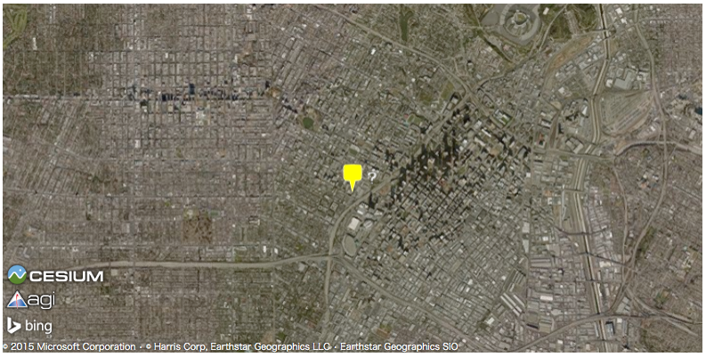
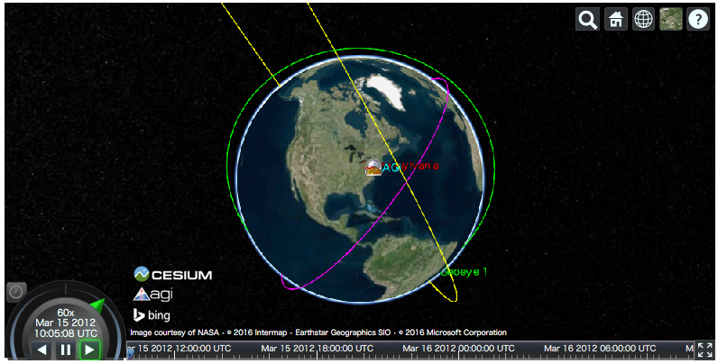
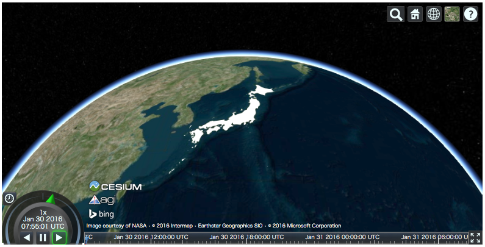
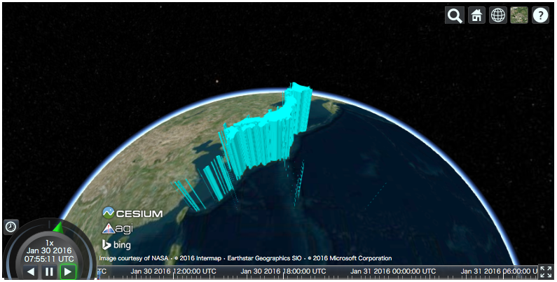
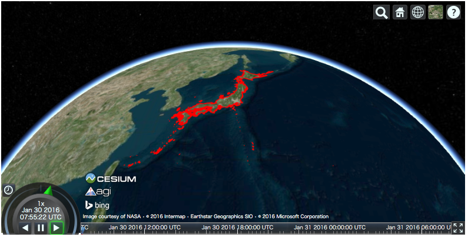
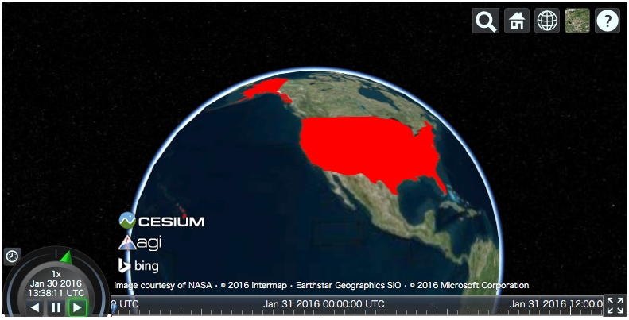
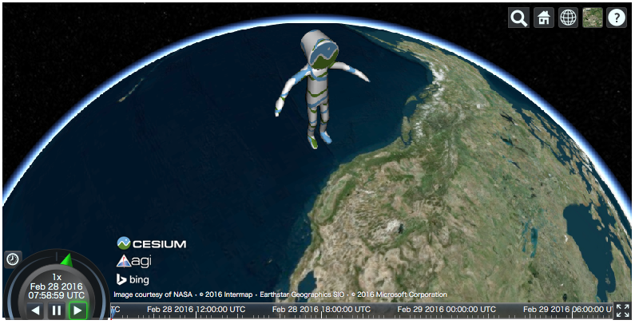

Read External Files as Data Source
==================================

`Cesium.js <http://cesiumjs.org/>`_ has a ``DataSource`` class which
can draw external data as entities.

``cesiumpy`` currently supports following ``DataSource``.

- ``GeoJsonDataSource``
- ``KmlDataSource``
- ``CzmlDataSource``

GeoJSON
-------

Assuming we hanve following ``.geojson`` file named "example.geojson".

::

  {
      "type": "Point",
      "coordinates": [-118.27, 34.05 ]
  }

You can create ``GeoJsonDataSource`` instannce then add to ``Viewer.DataSources``.
``markerSymbol`` option specifies the symbol displayed on the marker.

.. code-block:: python

  >>> ds = cesiumpy.GeoJsonDataSource('./example.geojson', markerSymbol='!')
  >>> v = cesiumpy.Viewer()
  >>> v.dataSources.add(ds)
  >>> v

.. image:: ./_static/datasources01.png

Or, you can use ``load`` class method to instanciate ``DataSource`` like ``Cesium.js``.

.. code-block:: python

  >>> cesiumpy.GeoJsonDataSource.load('./example.geojson', markerSymbol='!')

KML
---

You can use ``KmlDataSource`` to read ``.kml`` files. Assuming we have following content:

::

  <?xml version="1.0" encoding="UTF-8"?>
  <kml xmlns="http://www.opengis.net/kml/2.2"> <Placemark>
   <name>?</name>
   <Point>
   <coordinates>-118.27,34.05,0</coordinates>
   </Point>
   </Placemark> </kml>

.. code-block:: python

  >>> ds = cesiumpy.KmlDataSource('example.kml')
  >>> v = cesiumpy.Viewer()
  >>> v.dataSources.add(ds)
  >>> v

CZML
----

The last example is use ``.czml`` file downloaded from the
`Cesium.js repository <https://github.com/AnalyticalGraphicsInc/cesium/blob/master/Apps/SampleData/simple.czml>`_

.. code-block:: python

  ds = cesiumpy.CzmlDataSource('sample.czml')
  v = cesiumpy.Viewer()
  v.dataSources.add(ds)
  v

Read External Files as Entities
===============================

``cesiumpy`` can read following file formats using ``io`` module. The results
are automatically converted to ``cesiumpy`` entities and can be added to
map directly.

- GeoJSON
- Shapefile

GeoJSON
-------

This example reads GeoJSON file of Japanese land area. ``cesiumpy.io.read_geojson``
returns a ``list`` of ``cesiumpy.Polygon``.

The file is provided by `mledoze/countries <https://github.com/mledoze/countries>`_ repositry.

.. code-block:: python

  >>> res = cesiumpy.io.read_geojson('jpn.geo.json')
  >>> type(res)
  list

You can add the ``list`` as entities.

.. code-block:: python

  >>> viewer = cesiumpy.Viewer()
  >>> viewer.entities.add(res)
  >>> viewer

If you want to change some properties, passing keyword arguments via ``entities.add`` methods is easy. Of cource it is also OK to change properties of each entity one by one.

.. code-block:: python

  >>> viewer = cesiumpy.Viewer()
  >>> viewer.entities.add(res, extrudedHeight=1e6, material='aqua')
  >>> viewer

Shapefile
---------

This example reads Shapefile of Japanese coastal lines. ``cesiumpy.io.read_shape``
returns a ``list`` of ``cesiumpy.Polyline``.

The file is provided by `地球地図日本 <http://www.gsi.go.jp/kankyochiri/gm_jpn.html>`_ website.

- 出典 (Source)：国土地理院ウェブサイト　

.. code-block:: python

  >>> res = cesiumpy.io.read_shape('coastl_jpn.shp')
  >>> type(res)
  list

Then, you can add the result to the map.

.. code-block:: python

  >>> viewer = cesiumpy.Viewer()
  >>> viewer.entities.add(res, material='red')
  >>> viewer

Bundled Data
------------

``cesiumpy`` bundles GeoJSON data provided by `mledoze/countries <https://github.com/mledoze/countries>`_ repositry. You can load them via ``cesiumpy.countries.get`` method passing country code or its name.

Please refer to `countries.json <https://github.com/mledoze/countries/blob/master/countries.json>`_ file
to check available country codes ("cca2" or "cca3") and names ("official name").

.. code-block:: python

  >>> usa = cesiumpy.countries.get('USA')
  >>> viewer = cesiumpy.Viewer()
  >>> viewer.entities.add(usa, material='red')
  >>> viewer

Read 3D Models
==============

`Cesium.js <http://cesiumjs.org/>`_ can handle 3D Model on the map.
For ``Cesium.js`` functionality, please refer to `3D Model Tutorial <https://cesiumjs.org/tutorials/3D-Models-Tutorial/>`_.

``cesiumpy`` allows to put 3D Model using ``cesiumpy.Model`` instance. Following
example shows to draw Cesium Man used in the above tutorial.

.. code-block:: python

  >>> m = cesiumpy.Model(url='data/Cesium_Man.gltf',
  ...                    modelMatrix=(-130, 40, 0.0), scale=1000000)
  >>> m
  Model("data/Cesium_Man.gltf")

  >>> viewer = cesiumpy.Viewer()
  >>> viewer.scene.primitives.add(m)
  >>> viewer

