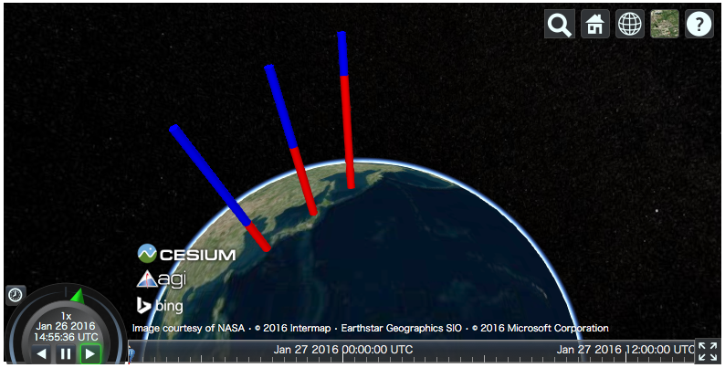

Plotting API
============

This section describes the plotting API of ``cesiumpy``. Plotting API allows
to add multiple entites at a time easily. You can call each plotting methods
via ``Viewer.plot`` accessor.

Scatter
-------

``Viewer.plot.scatter`` draws multiple ``Point`` entity accepting following keywords.
Both ``x`` and ``y`` must be provided at least.

- ``x``: Longitude
- ``y``: Latitude
- ``z``: Height
- ``size``: Pixel size
- ``color``: Color

.. code-block:: python

  >>> v = cesiumpy.Viewer()
  >>> v.plot.scatter([130, 140, 150], [30, 40, 50])

.. image:: ./_static/plotting_scatter01.png

For other keywords, you can use ``list`` or scalar. When ``list`` is passed,
each element is used in the corresponding entity. If scalar is passed,
all entities use the specified value.

.. code-block:: python

  >>> v = cesiumpy.Viewer()
  >>> v.plot.scatter([130, 140, 150], [30, 40, 50],
  ...                size=[10, 20, 30], color=cesiumpy.color.RED)

.. image:: ./_static/plotting_scatter02.png

Bar
---

``Viewer.plot.bar`` draws 3d bar using ``Cylinder`` entity accepting following keywords.
``x``, ``y`` and ``z`` must be provided at least.

- ``x``: Longitude
- ``y``: Latitude
- ``z``: Height
- ``size``: Radius
- ``color``: Color
- ``bottom``: Bottom heights

.. code-block:: python

  >>> v = cesiumpy.Viewer()
  >>> v.plot.bar([130, 140, 150], [30, 40, 50],
  ...            z=[10e5, 20e5, 30e5], color=cesiumpy.color.AQUA)

.. image:: ./_static/plotting_bar01.png

.. code-block:: python

  >>> v = cesiumpy.Viewer()
  >>> v.plot.bar([130, 140, 150], [30, 40, 50], z=[10e5, 20e5, 30e5],
  ...            color=cesiumpy.color.AQUA, size=1e5)

.. image:: ./_static/plotting_bar02.png

Specifying ``bottom`` keyword allows to draw stacked bar plot.

.. code-block:: python

  >>> v = cesiumpy.Viewer('viewertest')
  >>> v.plot.bar([130, 140, 150], [30, 40, 50], [1e6, 2e6, 3e6],
  ...            size=1e5, color=cesiumpy.color.RED)
  >>> v.plot.bar([130, 140, 150], [30, 40, 50], [3e6, 2e6, 1e6],
  ...            size=1e5, color=cesiumpy.color.BLUE,
  ...            bottom=[1e6, 2e6, 3e6])

Label
-----

``Viewer.plot.label`` draws texts using ``Label`` entity accepting following keywords.
``text``, ``x`` and ``y`` must be provided at least.

- ``text``: Labels
- ``x``: Longitude
- ``y``: Latitude
- ``z``: Height
- ``size``: Text size
- ``color``: Color

.. code-block:: python

  >>> v = cesiumpy.Viewer()
  >>> v.plot.label(['A', 'B', 'C'], [130, 140, 150], [30, 40, 50])

.. image:: ./_static/plotting_label01.png

Pin
---

``Viewer.plot.pin`` draws pins using ``Billboard`` entity accepting following keywords.
Both ``x`` and ``y`` must be provided at least.

- ``x``: Longitude
- ``y``: Latitude
- ``z``: Height
- ``text``: Label
- ``size``: Pin size
- ``color``: Color

.. code-block:: python

  >>> v = cesiumpy.Viewer()
  >>> v.plot.pin([130, 140, 150], [30, 40, 50])

.. image:: ./_static/plotting_pin01.png

.. code-block:: python

  >>> v = cesiumpy.Viewer()
  >>> v.plot.pin([130, 140, 150], [30, 40, 50],
  ...            color=cesiumpy.color.RED, text=['!', '?', '!?'])

.. image:: ./_static/plotting_pin02.png

Specifying Color
----------------

You can colorize each entity using ``cesiumpy.color.Color`` instance. Common
colors are defined under ``cesiumpy.color``. Refer to `Cesium Documentation <https://cesiumjs.org/Cesium/Build/Documentation/Color.html>`_ to see the list of constants.

.. code-block:: python

  >>> cesiumpy.color.AQUA
  Color.AQUA

Also, you can pass RGB or RGBA values to instanciate ``Color``.

.. code-block:: python

  # RGB
  >>> cesiumpy.color.Color(1, 0, 0)
  Color(1.0, 0.0, 0.0)

  # RGBA
  >>> cesiumpy.color.Color(1, 0, 0, 0.5)
  Color(1.0, 0.0, 0.0, 0.5)

If you want to use ``str`` representation, use ``fromString`` method.

.. code-block:: python

  >>> cesiumpy.color.Color.fromString("#FF0000")
  Color.fromCssColorString("#FF0000")

There are 2 functions to prepare color at random.

- ``choice``: Get a single color constant randomly.
- ``sample``: Get a ``list`` of random color constants with specified length.

.. code-block:: python

   >>> cesiumpy.color.choice()
   Color.DARKSLATEGREY

   >>> cesiumpy.color.sample(3)
   [Color.THISTLE, Color.PINK, Color.DARKKHAKI]

ColorMap
--------

Also, ``cesiumpy`` has ``ColorMap`` class which internally uses ``matplotlib`` ``ColorMap``.
This is convenient to prepare multiple colors based on external values.

.. code-block:: python

   >>> cmap = cesiumpy.color.get_cmap('winter')
   >>> cmap
   ColorMap("winter")

   >>> cmap(0.5)
   Color(0.0, 0.501960784314, 0.749019607843, 1.0)

   >>> cmap([0.2, 0.6])
   [Color(0.0, 0.2, 0.9, 1.0), Color(0.0, 0.6, 0.7, 1.0)]
