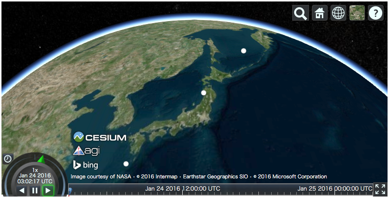
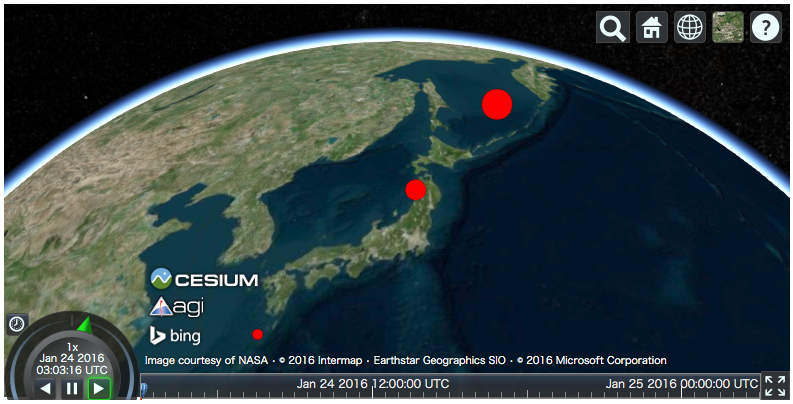
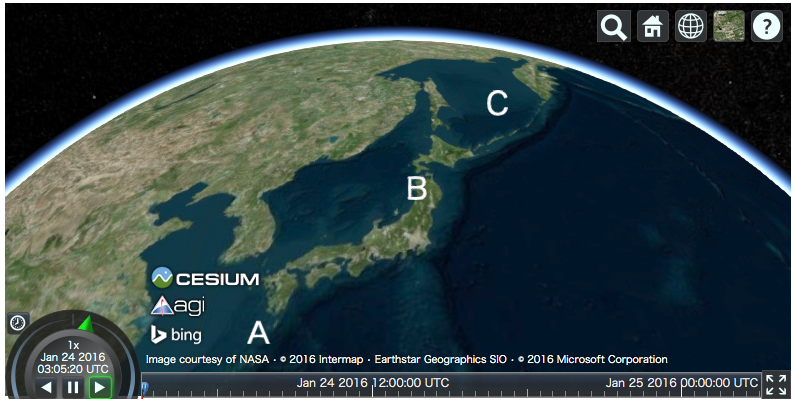
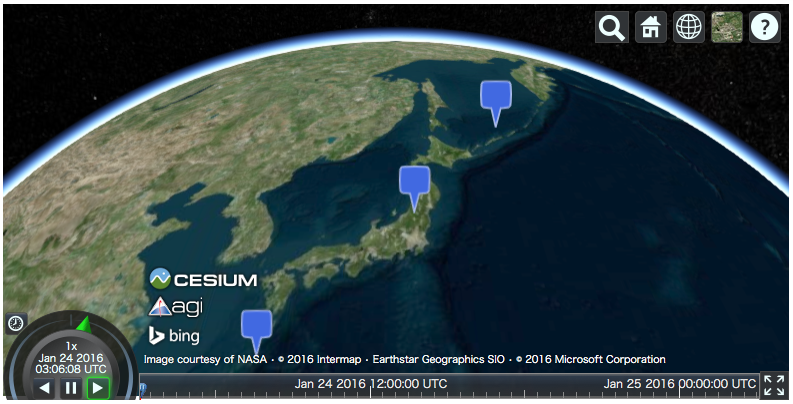
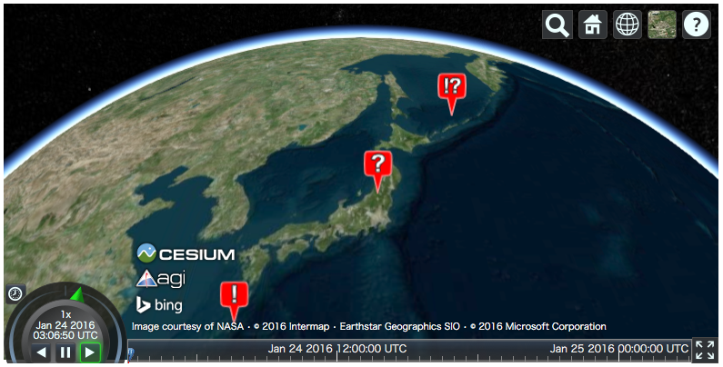

Plotting API
============

This section describes the plotting API of ``cesiumpy``. Plotting API allows
to add multiple entites at a time easily. You can call each plotting methods
via ``Viewer.plot`` accessor.

Scatter
-------

``Viewer.plot.scatter`` draws multiple ``Point`` entity accepting following keywords.
Both ``x`` and ``y`` must be provided at least.

- ``x``: Longitude
- ``y``: Latitude
- ``z``: Height
- ``size``: Pixel size
- ``color``: Color

.. code-block:: python

  >>> v = cesiumpy.Viewer()
  >>> v.plot.scatter([130, 140, 150], [30, 40, 50])

For other keywords, you can use ``list`` or scalar. When ``list`` is passed,
each element is used in the corresponding entity. If scalar is passed,
all entities use the specified value.

.. code-block:: python

  >>> v = cesiumpy.Viewer()
  >>> v.plot.scatter([130, 140, 150], [30, 40, 50],
  ...                size=[10, 20, 30], color=cesiumpy.color.RED)

Bar
---

``Viewer.plot.bar`` draws 3d bar using ``Cylinder`` entity accepting following keywords.
Both ``x`` and ``y`` must be provided at least.

- ``x``: Longitude
- ``y``: Latitude
- ``z``: Height
- ``size``: Radius
- ``color``: Color

.. code-block:: python

  >>> v = cesiumpy.Viewer()
  >>> v.plot.bar([130, 140, 150], [30, 40, 50],
  ...            z=[10e5, 20e5, 30e5], color=cesiumpy.color.AQUA)

.. image:: ./_static/plotting_bar01.png

.. code-block:: python

  >>> v = cesiumpy.Viewer()
  >>> v.plot.bar([130, 140, 150], [30, 40, 50], z=[10e5, 20e5, 30e5],
  ...            color=cesiumpy.color.AQUA, size=1e5)

.. image:: ./_static/plotting_bar02.png

Label
-----

``Viewer.plot.label`` draws texts using ``Label`` entity accepting following keywords.
``text``, ``x`` and ``y`` must be provided at least.

- ``text``: Labels
- ``x``: Longitude
- ``y``: Latitude
- ``z``: Height
- ``size``: Text size
- ``color``: Color

.. code-block:: python

  >>> v = cesiumpy.Viewer()
  >>> v.plot.label(['A', 'B', 'C'], [130, 140, 150], [30, 40, 50])

Pin
---

``Viewer.plot.pin`` draws pins using ``Billboard`` entity accepting following keywords.
Both ``x`` and ``y`` must be provided at least.

- ``x``: Longitude
- ``y``: Latitude
- ``z``: Height
- ``text``: Label
- ``size``: Pin size
- ``color``: Color

.. code-block:: python

  >>> v = cesiumpy.Viewer()
  >>> v.plot.pin([130, 140, 150], [30, 40, 50])

.. code-block:: python

  >>> v = cesiumpy.Viewer()
  >>> v.plot.pin([130, 140, 150], [30, 40, 50],
  ...            color=cesiumpy.color.RED, text=['!', '?', '!?'])

